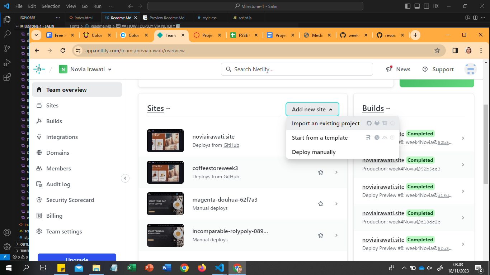

Hello, I m Novia Irawati

I m glad to present my first mini project with theme : Hospital


Here's my auto deploy from: netlify: [medirahospital](https://medirahospital.netlify.app/)

Here's my subdomain : [Medira Hospital](https://medirahospital.noviairawati.site/)

## STRUCTURE 📰

- Header
  - Section
  - Navbar
- Main
- Footer

## INGREDIENTS I USE 📜
- HTML
- CSS
- JavaScript
- External/Internal Source
  - Icon
  - Image
  - Fonts

## Source 📜
[CD Icon](https://cdnjs.cloudflare.com/ajax/libs/font-awesome/5.15.4/css/all.min.css)
[CDN Icon](https://cdn.jsdelivr.net/npm/remixicon@3.4.0/fonts/remixicon.css)
[Coolors](https://coolors.co/contrast-checker/112a46-acc8e5)
[Colorhunt](https://colorhunt.co/palette/0766ad29adb2c5e898f3f3f3)
[Font Google](https://fonts.google.com/)
[Freepik](https://www.freepik.com/)

## HOW TO SET UP 📰
You will need a github account to clone this repository, make sure you're connected to github.

1. Clone this repository
```
git clone https://github.com/revou-fsse-3/milestone-1-noviairawati.git
```
2. Create a new branch named "develop", in this repository we would like to develop the website with personal information. 
```
git branch -b "develop"
```
3. Once it's created, checkout to a new branch
```
git checkout -b "develop"
```
4. Develop & modify the website with your personal information, once it's done you will need to push it.
```
git add .
git commit -m "update message" // make sure to give details commit message to get better logs
git push origin develop 
```
5. Once you're done, you can merge into main/master branch for production build.
```
git checkout main
git pull origin main // pull the latest version before commit merge
git merge develop // if there are any conflicts, you should resolve them manually
git commit -m "Merge develop into main"
git push origin main
```

 ## Auto Deployement on Github with Netlify📰
 1. Login with Github


2. Click "Add New Site" > "Import an Existing Project"


3. Choose "Deploy with Github"


4. Select Your Repo
Now that you've connected Netlify and GitHub, you can see a list of your Git repos. Choose the repo you’d like to deploy from the list.


5. Let's deploy your project


6. Configure Your Settings
click the "Deploying" button to continue.


7. Now it's time to sit back and relax. You did your part; let Netlify take care of the rest. It'll only take a minute.


8. All Done
Once the build completes, your site is live! Head to the overview and you can see the URL of your newly published site.


## How to Setup Subdomain📰
1. Choose "Domain Management"


2. Choose "Add Domain"


3.Add "Subdomain"


## How to Setup SSL/TSL Certificate📰
1. Click "Force HTTPS"


2. Choose "Force HTTPS again"


3. Wait for a minute


4. Your site has HTTPS enabled

